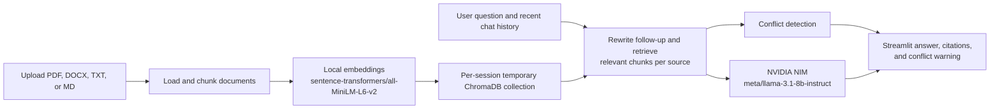

# MultiDocChat

🔗 **[Live Demo](https://multidocchats.streamlit.app/)**

## Screenshots


 

MultiDocChat is a Streamlit retrieval-augmented generation (RAG) app for asking
grounded questions across multiple uploaded documents. It accepts PDF, DOCX,
plain-text, and Markdown files, answers with source attribution, keeps a short
conversation history for follow-up questions, and warns when sources disagree.

## Problem statement

Information is often spread across several documents: for example, a policy may
have multiple versions, while supporting details live in a separate brief or
resume. Reading each file manually is slow, and a general chat model can invent
answers when it is not constrained by the source material.

MultiDocChat indexes an uploaded document set and retrieves the most relevant
passages for each question. The chat model is instructed to use that evidence,
cite it inline, and surface a separate warning when the retrieved sources make
conflicting claims.

## Architecture

The application uses LangChain to coordinate loading, chunking, retrieval, and
chat generation. Streamlit provides the upload and chat UI.



### Components

| Concern | Implementation |
|---|---|
| Framework and UI | LangChain + Streamlit |
| Embeddings | Local `sentence-transformers/all-MiniLM-L6-v2` (MiniLM) |
| Vector store | ChromaDB via `langchain-chroma` |
| Chat model | NVIDIA NIM `meta/llama-3.1-8b-instruct` |
| Supported inputs | PDF, DOCX, TXT, Markdown |
| Evidence handling | Chunk metadata preserves filename, chunk ID, and page or section where available |

Embeddings run locally; the NVIDIA API key is required only for chat generation,
follow-up-question rewriting, and the LLM-assisted conflict comparison. A new
temporary Chroma collection is created when the upload batch changes, so one
document set is not mixed with another.

## Setup

### Prerequisites

- Conda, with the existing `launchpad` environment available.
- An NVIDIA NIM API key from [NVIDIA Build](https://build.nvidia.com/). Use a
  personal account if an institutional account has no NIM quota.

The shared `launchpad` environment already includes the heavier local embedding
dependencies: `torch`, `transformers`, and `sentence-transformers`. Reuse it;
do not reinstall those packages for this project.

### Install

```powershell
conda activate launchpad
cd "D:\Launchpad project\multidocchat"
pip install -r requirements.txt
Copy-Item .env.example .env
```

Open `.env` and set the required key:

```dotenv
NVIDIA_API_KEY=your_actual_nvidia_nim_key
```

`OPENAI_API_KEY` and `GOOGLE_API_KEY` are included as placeholders for future
provider experiments; they are not needed for the current Phase 8 stack.
`.env` is intentionally ignored by Git, while `.env.example` is tracked.

### Run

```powershell
streamlit run app.py
```

Then open the local Streamlit URL, upload one or more supported files, and ask a
question. Use the sidebar to adjust the number of retrieved chunks per file or
to clear the current index and conversation.

### Useful commands

Run the test suite:

```powershell
python -m unittest discover -s tests -v
```

Inspect document chunks and their attribution metadata:

```powershell
python -m ingestion.loaders samples\example.pdf samples\notes.md samples\brief.docx
```

Run the evaluation set:

```powershell
python -m eval.run_eval
```

## Evaluation summary

The Phase 7 baseline evaluation used local MiniLM embeddings, NVIDIA NIM
`meta/llama-3.1-8b-instruct`, a fresh temporary Chroma collection, and the four
sample files. Full details and the per-case scorecard are in
[eval/eval_results.md](eval/eval_results.md).

| Metric | Result |
|---|---:|
| Retrieval precision@k | **100% (15/15)** |
| Full answer correctness | **60% (9/15)** |
| Conflict-detection recall | **100% (3/3)** |

Retrieval found a correct supporting chunk for every evaluated question. The
gap in fully correct answers is therefore primarily a small-model generation
limitation, not a retrieval failure: the 8B model sometimes reports that no
information is available even when the right context is present. Other known
limitations are inconsistent strict citation formatting, false-positive
conflict triggers for unrelated retrieved topics, and occasional drift in
ambiguous multi-turn references. See the evaluation report for examples and
the complete methodology.

## Project layout

```text
app.py                 Streamlit application
ingestion/             File loaders, chunking, embeddings, and ChromaDB setup
chains/                QA, citation, conflict-detection, and LLM configuration
memory/                Session-based conversation history
eval/                  Evaluation questions, runner, and results
tests/                 Focused unit tests
samples/               Demo documents
```
