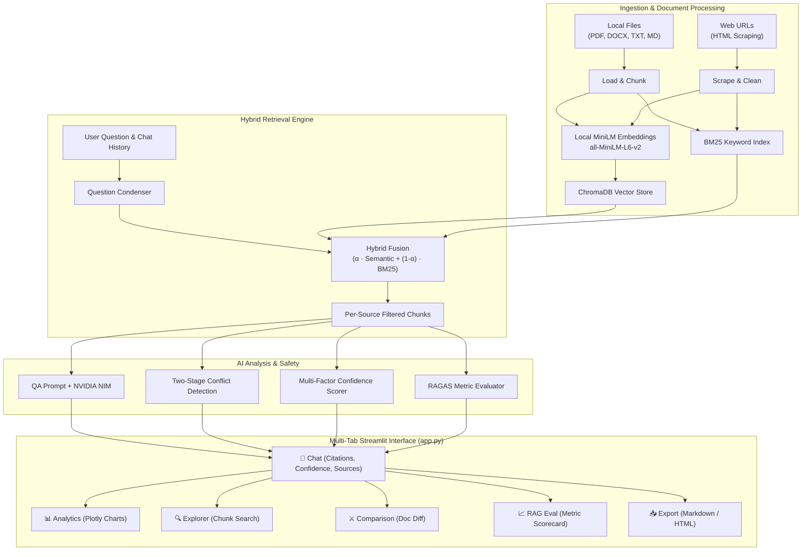

# MultiDocChat v2

🔗 **[Live Demo](https://multidocchats.streamlit.app/)**

MultiDocChat v2 is an advanced, production-grade Document Intelligence and Retrieval-Augmented Generation (RAG) platform. It enables attributed question answering, automated document comparison, quantitative RAG evaluation, collection analytics, and session report exports across multi-format documents and live web pages.

Engineered with a **100% free and open-source stack**, MultiDocChat v2 uses local HuggingFace embeddings (`all-MiniLM-L6-v2`), a pure-Python BM25 keyword search engine, ChromaDB vector storage, and a centrally configured NVIDIA NIM chat model, requiring zero paid API keys.

---

## Key Features in v2

- 🔀 **Hybrid Search Engine**: Combines ChromaDB dense vector similarity with a pure-Python BM25 Okapi keyword index using min-max score normalization and weighted fusion ($\text{Score} = \alpha \cdot \text{Semantic}_{\text{norm}} + (1-\alpha) \cdot \text{BM25}_{\text{norm}}$).
- 📁 **Dual Ingestion Engine**: Accepts local files (PDF, DOCX, TXT, Markdown) as well as live Web URLs via HTTP scraping and HTML cleaning.
- 💬 **Attributed Chat Interface**: ChatGPT/Claude-style bottom-anchored input with inline `[filename — section]` citations, collapsible source dropdowns (`📚 Cited Sources`), and one-click quick-query shortcuts.
- 🎯 **Multi-Factor Confidence Scoring**: Computes a quantitative confidence score (0.0 to 1.0) and renders color-coded badges (**High**, **Medium**, **Low**) for every assistant response.
- ⚔️ **Two-Stage Source Conflict Detection**: Detects contradictory statements between policy or document versions using a fast local heuristic gate followed by a targeted LLM verification call.
- 📊 **Plotly Analytics Dashboard**: Dedicated analytics tab displaying document chunk distributions, chunks-per-source bar charts, character length histograms, and turn-by-turn citation metrics.
- 🔍 **Document Chunk Explorer**: Full-text search across all indexed chunks with pagination and raw JSON metadata inspection.
- ⚔️ **Document Comparison & Diff Engine**: Line-by-line unified diff analysis between contract/policy versions paired with an LLM-generated executive summary.
- 📈 **Automated RAGAS Scorecard**: Real-time evaluation of **Faithfulness**, **Answer Relevancy**, **Context Precision**, and **Context Recall**.
- 📥 **Session Report Exporter**: One-click download of chat transcripts, cited excerpts, confidence scores, and conflict callouts in Markdown (`.md`) and printable HTML/PDF (`.html`) formats.
- ⚙️ **Centralized YAML Configuration**: Master `config/settings.yaml` with environment variable substitution (`${ENV_VAR:default}`) and runtime dot-notation accessors.
- 🛡️ **Comprehensive Test Suite**: **34/34 passing automated unit tests** covering retrieval, keyword indexing, score normalization, memory windowing, conflict detection, and RAG metrics.

---

## Architecture

MultiDocChat v2 uses a modular, multi-tier architecture coordinating document processing, hybrid retrieval, chain execution, analytics, and evaluation.


```mermaid
flowchart TD
    subgraph Ingestion ["Ingestion & Document Processing"]
        F["Local Files\n(PDF, DOCX, TXT, MD)"] --> L["Load & Chunk"]
        U["Web URLs\n(HTML Scraping)"] --> S["Scrape & Clean"]
        L & S --> K["BM25 Keyword Index"]
        L & S --> E["Local MiniLM Embeddings\nall-MiniLM-L6-v2"]
        E --> V["ChromaDB Vector Store"]
    end

    subgraph Retrieval ["Hybrid Retrieval Engine"]
        Q["User Question & Chat History"] --> C["Question Condenser"]
        C --> H["Hybrid Fusion\n(α · Semantic + (1-α) · BM25)"]
        V --> H
        K --> H
        H --> R["Per-Source Filtered Chunks"]
    end

    subgraph Intelligence ["AI Analysis & Safety"]
        R --> QA["QA Prompt + NVIDIA NIM"]
        R --> CD["Two-Stage Conflict Detection"]
        R --> CS["Multi-Factor Confidence Scorer"]
        R --> EV["RAGAS Metric Evaluator"]
    end

    subgraph UI ["Multi-Tab Streamlit Interface (app.py)"]
        QA & CD & CS & EV --> TAB1["💬 Chat (Citations, Confidence, Sources)"]
        TAB1 --> TAB2["📊 Analytics (Plotly Charts)"]
        TAB1 --> TAB3["🔍 Explorer (Chunk Search)"]
        TAB1 --> TAB4["⚔️ Comparison (Doc Diff)"]
        TAB1 --> TAB5["📈 RAG Eval (Metric Scorecard)"]
        TAB1 --> TAB6["📥 Export (Markdown / HTML)"]
    end
```

### Technical Stack

| Category | Component / Library | Usage |
|---|---|---|
| **UI Framework** | Streamlit `1.59.0` | Multi-tab web layout, chat interface, custom CSS theme |
| **Orchestration** | LangChain `1.3.11` | Document loading, prompt templates, chain coordination |
| **Embeddings** | HuggingFace `sentence-transformers/all-MiniLM-L6-v2` | Dense local embeddings (384 dims, offline) |
| **Keyword Index** | Custom BM25 Okapi (`ingestion/keyword_search.py`) | Pure-Python sparse term frequency scoring |
| **Vector Store** | ChromaDB `1.5.9` via `langchain-chroma` | Isolated per-session vector persistence |
| **LLM Engine** | NVIDIA NIM `nvidia/nemotron-3-super-120b-a12b` (set in `chains/qa_chain.py`) | Chat generation, question condensing, conflict analysis |
| **Web Ingestion** | `requests` + `BeautifulSoup4` | HTTP scraping & clean HTML text extraction |
| **Analytics** | Plotly `6.9.0` + Pandas `3.0.3` | Interactive visual charts & data manipulation |
| **Configuration** | PyYAML `6.0.3` | Master `config/settings.yaml` loader & env var substitution |
| **Logging** | Python `logging` | Structured file (`logs/multidocchat.log`) & console logging |

---

## Setup & Quick Start

### Prerequisites

- Conda, with the `launchpad` environment active.
- An NVIDIA NIM API key from [NVIDIA Build](https://build.nvidia.com/) (free tier).

### Installation

```powershell
conda activate launchpad
cd "D:\Launchpad project\multidocchat"
pip install -r requirements.txt
Copy-Item .env.example .env
```

Set your NVIDIA API key in `.env`:

```dotenv
NVIDIA_API_KEY=your_actual_nvidia_nim_key
```

Optional NVIDIA settings in `.env`:

```dotenv
# Keep TLS verification on. On a managed/TLS-inspected network, set this to your CA
# bundle path; use false only if that certificate cannot be installed.
NVIDIA_SSL_VERIFY=true
```

> **Troubleshooting:** NVIDIA's free hosted tier is occasionally slow or returns `503 Service temporarily overloaded`. Requests time out after 45 s and are retried up to 4 times. If chat still times out, the configured model may be unavailable (e.g. `meta/llama-3.1-8b-instruct` was retired) — change `DEFAULT_NVIDIA_MODEL` in `chains/qa_chain.py` to another model listed at `https://integrate.api.nvidia.com/v1/models`.

### Running the Application

```powershell
streamlit run app.py
```

Open the local Streamlit URL (e.g. `http://localhost:8501`), upload documents or paste web page URLs, and begin querying!

---

## Testing & Verification

MultiDocChat v2 comes with a unit test suite verifying all core modules:

```powershell
python -m unittest discover -s tests -v
```

### Test Coverage (34/34 Passing Tests):
- `test_hybrid_search.py` (12 tests): Tokenization, BM25 Okapi scoring, per-source balancing, min-max score normalization, and hybrid chunk deduplication.
- `test_capstone_features.py` (9 tests): RAGAS metrics (Faithfulness, Relevancy, Precision, Recall), document line diff engine, and Markdown/HTML report generators.
- `test_per_source_retrieval.py` (8 tests): Per-source retrieval balancing, L2 distance filtering, dynamic $k$-expansion, and citation extraction.
- `test_conflict.py` (3 tests): Contradictory policy detection, matching source bypass, and low-relevance exclusion.
- `test_conversation_memory.py` (2 tests): 6-turn history windowing and follow-up question condensing.

---

## Project Structure

```text
MultiDocChat/
├── app.py                 # Streamlit multi-tab application & UI controller
├── config/                # Centralized YAML configuration system
│   ├── settings.yaml      # Master configuration settings
│   └── config_manager.py  # Env-var substitution & dot-notation config accessor
├── analytics/             # Interactive Plotly analytics & document explorer
│   ├── dashboard.py       # Collection analytics & turn metrics
│   └── explorer.py        # Full-text chunk browser & metadata inspector
├── chains/                # RAG execution chains & AI engines
│   ├── qa_chain.py        # QA prompt builder, LLM factory, & confidence scoring
│   ├── conflict.py        # Two-stage source conflict detection
│   └── comparison.py      # Line diff engine & executive comparison report
├── ingestion/             # Document processing & retrieval storage
│   ├── loaders.py         # Multi-format document loaders & metadata tagging
│   ├── keyword_search.py  # Pure-Python BM25 Okapi search engine
│   ├── vectorstore.py     # ChromaDB setup, embeddings, & hybrid score fusion
│   └── web_scraper.py     # Web URL HTML scraper & clean text converter
├── memory/                # Session-based windowed conversation history
│   └── session.py         # 6-turn memory window manager
├── eval/                  # Evaluation framework & RAGAS metrics
│   ├── metrics.py         # Faithfulness, Relevancy, Precision, & Recall scoring
│   ├── eval_questions.py  # 15 fixed evaluation test cases
│   └── run_eval.py        # CLI evaluation runner
├── export/                # Session report generation
│   └── report.py          # Markdown & Printable HTML report export
├── logging_config.py      # Structured file & console logger
├── tests/                 # Unit test suite (34 passing test cases)
└── samples/               # Evaluation & demo test documents
```

---

## License

MIT License
